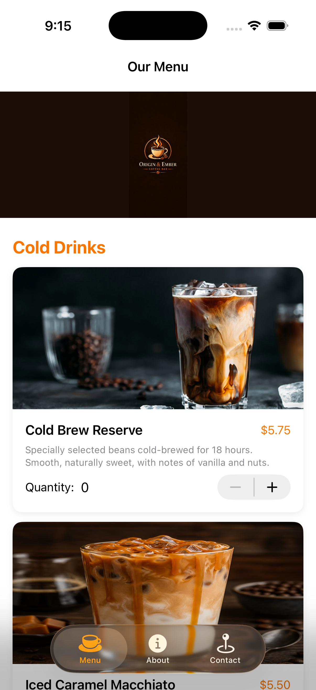
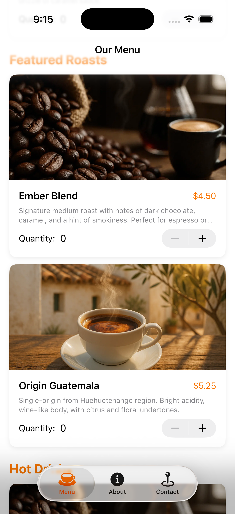
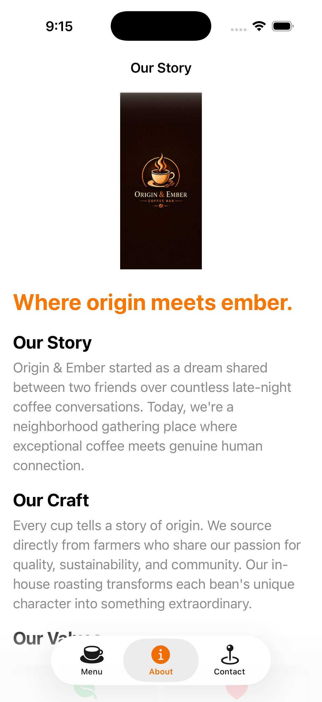
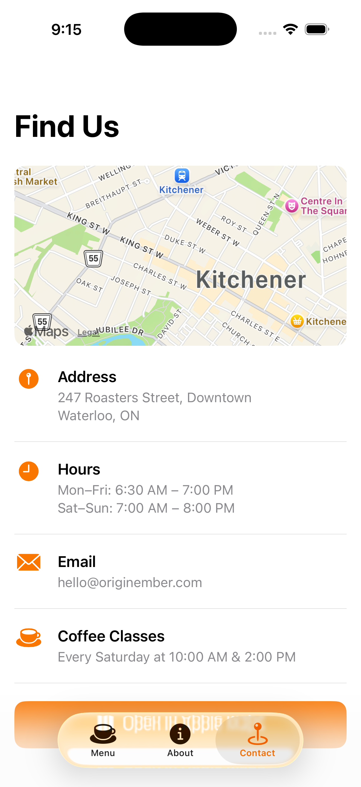
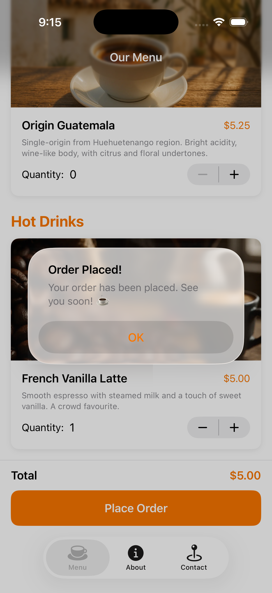

# TimsOrder ☕

A Tim Hortons team ordering app built with SwiftUI for iOS.

Instead of writing down coffee orders on paper, team members can use this app to record each person's order and save it for future use.

## Features

- 📋 **My Order Tab** — Select your drink, size, extras, and food from the Tim Hortons menu. Your name is remembered between sessions.
- 👥 **Team Orders Tab** — View all saved team orders in one place. Tap any order to see full details. Swipe left to delete.
- ⏱ **Coffee Run Timer** — Set a countdown for how long the coffee run will take, with an animated ring that tracks progress.

## Screenshots

| My Order | Order Saved | Team Orders | Timer | Extra |
|---|---|---|---|---|
|  |  |  |  |  |

## Tech Stack

- Swift & SwiftUI
- `@State`, `@AppStorage`, `@EnvironmentObject`
- `ObservableObject` + `@Published`
- `UserDefaults` for persistence
- `Timer.publish()` for the countdown
- `TabView`, `NavigationStack`, `Form`, `List`

## Topics Covered (HIITFit Tutorial Mapping)

| SwiftUI Concept | Where Used |
|---|---|
| `@State` | OrderView, CoffeeRunTimerView |
| `@AppStorage` | Saved name, timer duration |
| `@EnvironmentObject` | Shared OrderViewModel |
| `TabView` | Main navigation |
| `NavigationStack` | All three tabs |
| `List` + `ForEach` | TeamOrdersView |
| `Timer.publish` | CoffeeRunTimerView |
| Persistence | UserDefaults via OrderViewModel |

## Author

Jeancarlo — Web & Mobile Development Student @ triOS College
